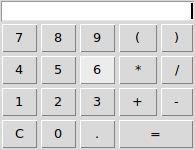

# tCalc
**tCalc** is a simple clipboard manager written in [Tcl/Tk](https://www.tcl.tk)

##### Features:
* History
* Editable entry
* Full Tcl math support
* CLI evaluation (optional)

### Screenshot

## DEPENDENCIES
**Tcl** version 8.5 or later.

**Tk** version 8.5 or later.

##### For MS-Windows users:
[ActiveTcl](https://www.activestate.com/activetcl) version 8.5 or later.

## LICENSE
**tEdit** is licensed under the **MIT License**.

Read LICENSE for details.
