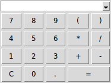

----

**tCalc** is a simple calculator written in core [Tcl/Tk](https://www.tcl.tk).

----

### Features

* On Top
* History
* Editable entry
* Resizable Buttons
* Full Tcl math support
* Command Line support
* Customizable precision
* Runs in GNU/Linux, MS-Windows and Unix (MacOS not tested)

----

#### Constants & Functions

| Constants | Description          |
|-----------|----------------------|
| `e()`     | &#8455; |
| `pi()`    | &pi;    |
| `phi()`   | &phi;   |
| `c()`     | speed of light       |

| Generic        | Description              | Altenative |
|----------------|--------------------------|------------|
| `sqrt(x)`      | &#8730;x    |
| `pow(x,y)`     | xy            | `x**y`     |
| `fmod(x,y)`    | remainder of `x/y`       | `x%y`      |
| `hypot(x,y)`   | hypotenuse               |
| `quadf(a,b,c)` | quadratic formula        |
| `abs(x)`       | \|x\|                    |
| `log(x)`       | ln(x)                    |
| `log10(x)`     | log10(x)      |
| `exp(x)`       | ex            |
| `round(x)`     | nearest integer          |
| `ceil(x)`      | next smallest integer    |
| `floor(x)`     | previous largest integer |
| `max(x,y,..)`  | greatest number          |
| `min(x,y,..)`  | smallest number          |

| Trigonometric | Description        | Type    |
|---------------|--------------------|---------|
| `sind(x)`     | sine               | degrees |
| `cosd(x)`     | cosine             | degrees |
| `tand(x)`     | tangent            | degrees |
| `asind(x)`    | arc sine           | degrees |
| `acosd(x)`    | arc cosine         | degrees |
| `atand(x)`    | arc tangent        | degrees |
| `sin(x)`      | sine               | radians |
| `cos(x)`      | cosine             | radians |
| `tan(x)`      | tangent            | radians |
| `asin(x)`     | arc sine           | radians |
| `acos(x)`     | arc cosine         | radians |
| `atan(x)`     | arc tangent        | radians |
| `sinh(x)`     | hyperbolic sine    | radians |
| `cosh(x)`     | hyperbolic cosine  | radians |
| `tanh(x)`     | hyperbolic tangent | radians |

| Date/Time    | Description                         |
|--------------|-------------------------------------|
| `days(x,y)`  | calculate days format: `%d%m%Y` |
| `hours(x,y)` | calculate hours format: `%H%M`  |

| Convert        | Description           |
|----------------|-----------------------|
| `btu2watt(x)`  | convert BTUs to Watts |
| `watt2btu(x)`  | convert Watts to BTUs |

----

### Screenshot

----

### Dependencies

**Tcl** version 8.6 or later.

**Tk** version 8.6 or later.

##### For Microsoft Windows users:

[ActiveTcl](https://www.activestate.com/activetcl) version 8.6 or later.

Executable can be found in the [Releases](https://github.com/thanoulis/tcalc/releases) section.

To run it, after download, right-click->Properties->Unblock.

----

### License

**tEdit** is licensed under the **MIT License**.

Read [LICENSE](LICENSE) for details.

----
